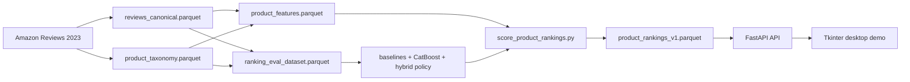

# FitIQ


FitIQ is an apparel ranking project built on Amazon Reviews 2023.

The goal is to rank products inside comparable apparel groups so an e-commerce platform can surface items that are more likely to satisfy users on fit and overall quality.

The project currently includes:
- review ingestion from Amazon Reviews 2023
- metadata-driven taxonomy building
- product-level feature generation
- leakage-safe offline ranking evaluation
- CatBoost ranking models and a query-group hybrid serving policy
- a full-corpus ranking artifact
- a read-only FastAPI service
- a Tkinter desktop demo client

  


## Main idea

The system uses weak public signals from reviews and metadata:
- star ratings
- fit complaints
- quality complaints
- review count
- recency
- product metadata

Products are ranked inside `query_group_v2`, which is the current serving key.

Current query groups:
- `general_items`
- `tops_shirts`
- `tops_sweater`
- `bottoms_pants`
- `bottoms_other`
- `dress`
- `footwear`
- `intimates_sleep`
- `outerwear`

`general_items` is the catch-all bucket for products that do not land in a more specific fine group.

## Pipeline

The offline pipeline is:

1. Build canonical reviews from raw Amazon review data.
2. Build a product taxonomy table from metadata.
3. Build product-level features.
4. Build a leakage-safe ranking evaluation dataset.
5. Run heuristic baselines.
6. Train and tune the CatBoost ranker.
7. Build the query-group hybrid policy.
8. Score the full product corpus and write the serving artifact.

Two different tables matter here:

- `ranking_eval_dataset.parquet`
  This is the training and evaluation table. It is built from joined reviews + taxonomy data using time-based `60% / 75% / 90%` timestamp cutoffs so the model only sees past reviews when features are created and future reviews when labels are created.
- `product_features.parquet`
  This is the full product table for serving-time scoring. It is not the training split table. After the CatBoost ranker and hybrid policy are trained from the ranking eval dataset, they are applied to this full product table to create the final ranked artifact.

High-level flow:



What each stage is doing:

- `reviews_canonical.parquet`
  Clean review-level table. One row per review.
- `product_taxonomy.parquet`
  Metadata-derived product grouping table. This is where the product labels and grouping information come from.
- `ranking_eval_dataset.parquet`
  Joined review + taxonomy table rebuilt into leakage-safe train, validation, and test snapshots for model training and offline evaluation.
- `product_features.parquet`
  Full-corpus product table. One row per ASIN. This is what gets scored after training is finished.
- `product_rankings_v1.parquet`
  Final serving artifact with one score per ASIN, grouped by `query_group_v2`, ready for the API and desktop app.

## Current v1 setup

The frozen v1 serving artifact uses the query-group hybrid scorer.

Important serving files:
- `data/processed/product_rankings_v1.parquet`
- `data/processed/product_rankings_v1_summary.json`
- `data/processed/fitiq_v1_manifest.json`

Serving details:
- score column: `score_fitiq_v1`
- query key: `query_group_v2`
- serving policy: `query_group_hybrid_v1`

Latest rebuilt test metrics:

| Scorer | NDCG@10 | NDCG@20 | Spearman |
| --- | ---: | ---: | ---: |
| `blended_score` | 0.9016 | 0.8950 | 0.2465 |
| `query_group_hybrid_v1` | 0.8971 | 0.8958 | 0.2776 |

So the current serving scorer is competitive with the heuristic baseline, slightly lower on test `NDCG@10`, basically tied on `NDCG@20`, and better on Spearman.

## Repo structure

- `data/`
  Raw-to-processed pipeline scripts and data artifacts.
- `models/`
  Model training, tuning, hybrid policy building, and full-corpus scoring.
- `evaluation/`
  Ranking metrics, baselines, comparisons, and error analysis.
- `api/`
  Read-only FastAPI service for the ranking artifact.
- `desktop/`
  Tkinter desktop demo client.
- `scripts/`
  Convenience scripts for rebuilding and running the demo.

## Main artifacts

Review-level:
- `data/processed/reviews_canonical.parquet`

Product-level:
- `data/processed/product_taxonomy.parquet`
- `data/processed/product_features.parquet`

Evaluation:
- `data/processed/ranking_eval_dataset.parquet`
- `data/processed/ranking_eval_dataset_manifest.json`
- `evaluation/results/baseline_benchmark_results.json`
- `evaluation/results/tuned_catboost_ranker_results.json`
- `evaluation/results/query_group_hybrid_results.json`

Serving:
- `models/artifacts/tuned_catboost_ranker.cbm`
- `models/artifacts/query_group_hybrid_policy.json`
- `data/processed/product_rankings_v1.parquet`
- `data/processed/product_rankings_v1_summary.json`
- `data/processed/fitiq_v1_manifest.json`

## Environment setup

Create a fresh environment and install dependencies:

```bash
python -m venv .venv
.venv\Scripts\activate
pip install -r requirements.txt
```

## Rebuild the full v1 pipeline

This runs the current offline pipeline in order and regenerates the v1 serving artifact:

```bash
python scripts/build_v1.py
```

That script runs:
1. `data/build_reviews_table.py`
2. `data/build_product_taxonomy.py`
3. `data/build_product_features.py`
4. `data/build_ranking_eval_dataset.py`
5. `evaluation/run_baseline_benchmarks.py`
6. `models/train_catboost_ranker.py`
7. `models/tune_catboost_ranker.py`
8. `models/train_query_group_hybrid_ranker.py`
9. `models/score_product_rankings.py`

## Run the API

Start the local FastAPI server:

```bash
python scripts/run_demo.py
```

Default local address:

```text
http://127.0.0.1:8000
```

Current endpoints:
- `GET /health`
- `GET /query-groups`
- `GET /rankings/{query_group_v2}?limit=20&offset=0`
- `GET /products/{asin}`

## Run the desktop demo

Start the Tkinter desktop client:

```bash
python scripts/run_desktop_demo.py
```

By default this starts the local API in the background and opens the desktop GUI.

## Notes from development

A few changes mattered a lot during development:
- taxonomy generation was fixed so metadata builds stopped accidentally reading review rows
- the ranking label was updated to include rating, low-star, fit, and quality signals
- `query_group_v2` replaced the older broader grouping setup
- the fallback group is now `general_items`
- the serving feature contract was aligned with the trained model inputs

## Current limitations

- labels are still weak labels built from public review signals
- the system is not personalized
- the API is read-only and meant for local/demo use
- there is no online scoring path
- there is no Docker packaging in the current v1 milestone
- there are no vision features or neural ranking features yet

## Possible follow-up work

- API hardening and auth
- Docker packaging
- stronger label design
- better fine-grained grouping
- additional metadata features
- multimodal features later on
